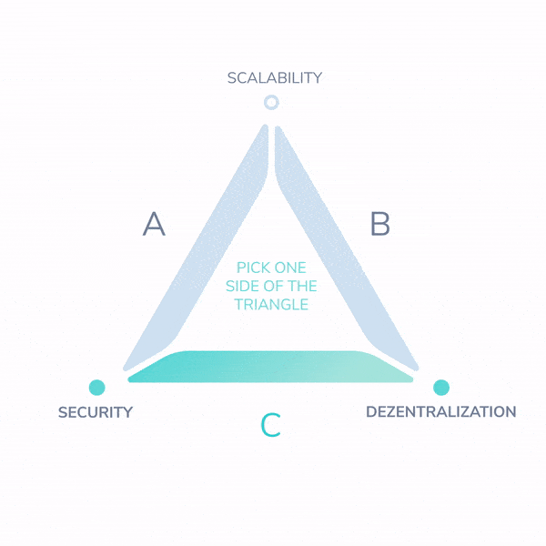

# IOTA Post-Coordinator

Ziel von Coordicide ist es, dass das Netzwerk ohne den Koordinator einen Konsens erzielt und gleichzeitig die folgenden Eigenschaften aufweist:

- Skalierbar: Die Transaktionsrate im Netzwerk ist nicht durch das Protokoll begrenzt.
- Sicher: Ein Angreifer kann den Konsens nicht beeinflussen.
- Dezentral: Alle anständige Knoten können Teil des Konsensprozesses sein.

Aktuelle DLT-Lösungen können maximal zwei dieser drei Eigenschaften gleichzeitig garantieren. Dieses Problem wird als "[Skalierbarkeitstrilemma](https://github.com/ethereum/wiki/wiki/Sharding-FAQ)" bezeichnet.

Ein Beispiel für das Trilemma finden Sie in PoW-basierten Blockchains wie Bitcoin. Diese Netzwerke bieten Sicherheit und Dezentralisierung, sind jedoch nicht skalierbar:

- Sicherheit: Miner schließen PoW ab, um Transaktionsblöcke miteinander zu verketten. Die kombinierte Rechenleistung (Hash) der Miner sichert das Netzwerk.
- Dezentralisierung: Miner sind über das Netzwerk verteilt. Kein einzelner Miner kontrolliert den Großteil der Hashing-Kraft.

Bitcoin steht jedoch vor einem grundlegenden Problem der Skalierbarkeit. Um Dezentralisierung und Sicherheit zu gewährleisten, müssen Blöcke in der Bitcoin-Blockchain eine begrenzte Größe haben. Diese Beschränkung der Blockgröße begrenzt die Transaktionsrate und schränkt die Skalierbarkeit des Netzwerks ein. Da immer mehr Transaktionen über das Netzwerk gesendet werden, entscheiden sich Miner für die Validierung der Transaktionen mit den höchsten Gebühren, was zu steigenden Transaktionskosten und langen Wartezeiten führt. Der revolutionäre Charakter dieser PoW-basierten Lösung sollte nicht unterschätzt werden. Gleichzeitig können wir die eigenen Einschränkungen des Netzwerkdurchsatzes nicht überschätzen.

IOTA mit dem Koordinator ist skalierbar und sicher, aber nicht vollständig dezentralisiert:

- Skalierbar: Jede Transaktion referenziert und genehmigt zwei vorherige. Transaktionen können jederzeit und überall an den Tangle angehängt werden. Es sind keine Miner beteiligt.

- Sicher: Der Koordinator sichert das Netzwerk durch die Ausgabe von Meilensteintransaktionen. Knoten betrachten Transaktionen nur dann als vertrauenswürdig, wenn sie von einem gültigen Meilenstein referenziert und genehmigt wurden.

Mit dem Tangle können Benutzer neue Transaktionen an einen beliebigen Teil des Tangles anhängen. Aufgrund der DAG-Struktur ist nur erforderlich, dass jede neue Transaktion zwei weitere Transaktionen genehmigt. Durch die Option für mehrere Anhängestellen und den Wegfall von Blöcken ist der Tangle von Natur aus skalierbar.

Der Koordinator gewährleistet zwar die Netzwerksicherheit, stellt jedoch auch eine zentrale Fehlerquelle dar und schränkt daher IOTA als vollständig dezentralisiertes Netzwerk ein.

### Ein verbesserter Tangle: dezentral und sicher

Die Entfernung des Koordinators allein reicht nicht aus, um eine Dezentralisierung zu erreichen. Tatsächlich erforderte der ursprünglich im IOTA-Whitepaper vorgeschlagene Konsensmechanismus, dass die Mehrheit der Transaktionen immer von ehrlichen Netzwerkteilnehmern stammt. Mit anderen Worten, ehrliche Mitspieler müssten einen Großteil der Hashing-Macht des Netzwerks besitzen. Ohne Miner hat IOTA jedoch kein Konzept einer konstanten, ehrlichen Hashing-Kraft. Das heißt, dass ehrliche Knoten einen kontinuierlichen Strom von Transaktionen senden müssten, unabhängig davon, ob sie das Netzwerk tatsächlich nutzen.

Ziel von Coordicide ist es, das Skalierbarkeitstrilemma zu lösen, indem ein dezentrales, sicheres Netzwerk bereitgestellt wird und gleichzeitig eine hohe Transaktionsrate erhalten bleibt. Kern der Lösung ist ein Abstimmungsmechanismus, über den Knoten die Meinungen anderer Knoten anfordern, um zu entscheiden, welche Transaktionen in den Tangle aufgenommen und welche verwaist werden sollen.

Um den Koordinator zu entfernen, müssen eine Reihe von Herausforderungen gelöst werden. Aufgrund der Komplexität der Lösung wird Coordicide in verschiedene Komponenten unterteilt. Dieser Ansatz macht unseren Coordicide modular, was bedeutet, dass jedes Modul unabhängig ersetzt werden kann, wenn neue Forschungsergebnisse weitere Verbesserungen ergeben.

Unser Ziel ist es, IOTA zum Goldstandard zu machen: unternehmensfähiges DLT in Zusammenarbeit mit [wichtigen Organisationen](https://blog.iota.org/iota-becomes-a-founding-member-of-new-international-association-of-trusted-blockchain-applications-b0c6417aaded) und [Normungsorganisationen](https://www.omg.org/cgi-bin/doc?omg/2019-03-03) unter Verwendung von [Open Source Governance](https://projects.eclipse.org/proposals/eclipse-iota-trinity).

### [Nächstes Kapitel](./03_modularitaet.md)
### [Kapitel zurück](./01_iota_als_skalierbares_dlt.md)
