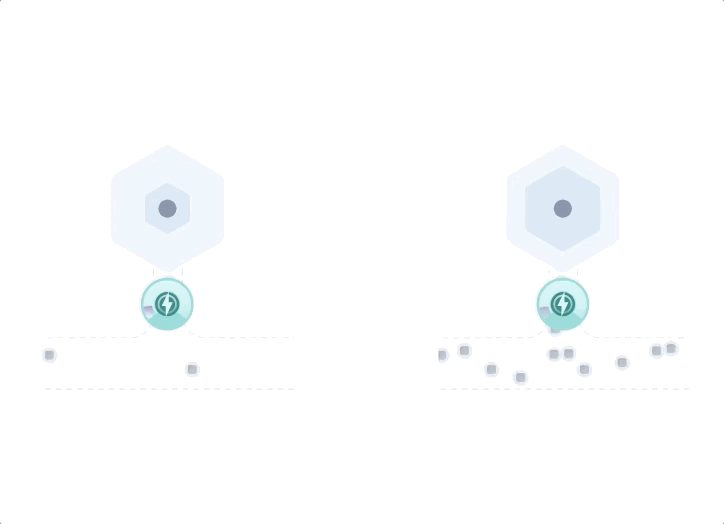

# MODUL 3  - SPAMSCHUTZ

DLTs erfordern einen Mechanismus zum Steuern der Rate von Transaktionen, die in das Netzwerk eintreten, da die begrenzten Ressourcen von Knoten (z. B. Bandbreite, CPU) überlastet werden können, was zu einem geringen Durchsatz führt. Dies ähnelt einer Autobahn, auf der eine große Anzahl von Fahrzeugen, die in den Verkehrsfluss einfahren, zu einer Überlastung führen kann.

Derzeit implementiert der Tangle einen einfachen Spam-Schutzmechanismus, der auf PoW basiert. Eine alleinige Kontrolle der Transaktionsemissionsrate durch PoW ist jedoch unpraktisch, da hierdurch Miner eingeführt werden. Wir schlagen einen adaptiven Ratensteuerungsmechanismus vor, der die Schwierigkeit des PoW pro Knoten auf intelligente Weise anhand verschiedener Faktoren wie der Anzahl der kürzlich ausgegebenen Transaktionen und des Manas variiert.

Es ist wichtig anzumerken, dass die Verwendung von PoW als Ratenkontrollmechanismus nicht mit einem auf PoW basierenden Konsens zusammenhängt, den unser Coordicide explizit beseitigt. Unser Ratenkontrollmechanismus ist so konzipiert, dass er weder zu Minern führt noch viel Energie benötigt.

In unserem Modell können Knoten mit höherem Mana mehr Transaktionen ausführen, ohne die gleichen PoW-Anforderungen wie Knoten mit niedrigerem Ruf. Unabhängig vom Mana eines Knotens steigt der PoW-Schwierigkeitsgrad mit der Transaktionsrate. d.h. um mehr Transaktionen in einem kurzen Zeitintervall auszugeben, muss ein Knoten die Schwierigkeit des kryptografischen Puzzles erhöhen, während für niedrigere Transaktionsraten eine viel niedrigere Schwierigkeit ausreichend wäre.

Wir erzwingen eine maximale Transaktionsrate pro Knoten, um Spam weiter zu verhindern. Dieses System bringt einen doppelten Vorteil:

- Es schützt das Netzwerk vor böswilligen schnellen Akteuren, z. B. Knoten, die ASICs verwenden, um das Netzwerk zu spammen und / oder den Konsens zu beeinflussen.

- Der Hauptanwendungsfall von IOTA ist das Internet der Dinge (IoT), das aus Knoten mit begrenzten Ressourcen besteht, die nur selten Transaktionen senden. Dieser Mechanismus ermöglicht es langsameren Knoten, ihre Transaktionen erfolgreich über das Netzwerk zu verbreiten.