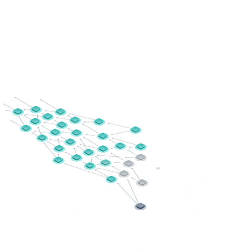
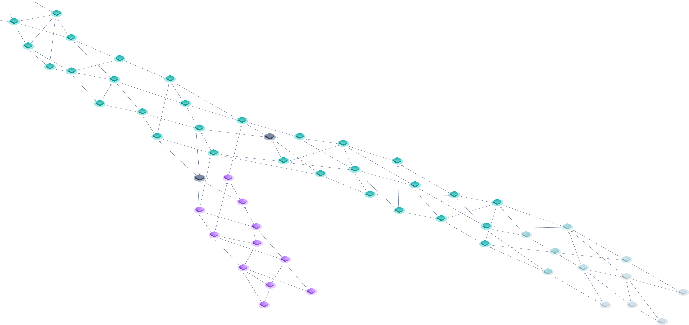

# MODUL 5  - SHIMMER

Das Shimmer-Abstimmungsschema ist nach einem außergewöhnlichen Verhalten in der Natur benannt. Bienen ["synchronisieren" ihre Bewegung, um sich gegen Raubtiere zu verteidigen](http://digg.com/video/honeybee-nest-shimmering). Sie tun dies ohne eine zentrale Einheit und wissen nur, wann sie ihren Zustand „ändern“ müssen, indem sie das Verhalten ihrer Kollegen beobachten.

Einzelne autonome Agenten, die nach vordefinierten Regeln agieren, sind in vielen Systemen der Natur zu finden, beispielsweise in Bienen, Ameisen, Fischschwärmen und sogar in einigen Bereichen der Physik. Sehr einfache Regeln können unglaublich komplexe Funktionen erstellen, die sich im Laufe der Zeit als neue Eigenschaften eines Systems manifestieren. Der Shimmer-Konsensus-Mechanismus funktioniert auf die gleiche Weise. Anstatt zu versuchen, die Meinung jedes anderen Knotens zu rekonstruieren, kümmern wir uns nur um die Meinung einer sehr kleinen Teilmenge von Knoten und lassen den Konsens **organisch** als eine aufstrebende Eigenschaft des Netzwerks entstehen.

Wenn unter Shimmer ein Konflikt auftritt, tauschen die Knoten iterativ Meinungen darüber aus, welche der widersprüchlichen Transaktionen sie bevorzugen, bis schließlich ein Konsens erzielt wird. Die Knoten erhalten eine globale Ansicht des bevorzugten Teils des Tangle, was für die Gewährleistung eines Konsenses von entscheidender Bedeutung ist. Irgendwann kann ein Knoten ferner beschließen, seine Entscheidung als abgeschlossen zu markieren. Dies bedeutet, dass es seine Beteiligung am Abstimmungsprozess einstellt und auch bei einer überwältigenden Meinungsänderung (aufgrund eines Angriffs) nie wieder von dieser Meinung abweichen wird.

Da Shimmer für den Konsens im Tangle verwendet wird, hat das „Mögen“ oder „Ablehnen“ einer Transaktion umfassendere Konsequenzen. Wenn eine Transaktion von einem Knoten "gemocht" wird, muss sie auch alle anderen Transaktionen "mögen", auf die direkt oder indirekt verwiesen wird. Wenn eine Transaktion dagegen "nicht gemocht" ist, kann keine Transaktion, die auf diese Transaktion verweist, "gemocht" werden.

Es ist wichtig zu beachten, dass nicht bei jeder Transaktion abgestimmt werden muss. Transaktionen, die mit keiner anderen Transaktion in Konflikt stehen, können allein aufgrund lokaler Modifikatoren (d. H. Nach Ablauf einer bestimmten Zeitspanne) als "beliebt" eingestuft werden. Abstimmungen sind nur erforderlich, um Konflikte und Randfälle zu lösen.

Knoten lehnen Stimmen ab, die zwei in Konflikt stehende Subtangles gleichzeitig bevorzugen. Dies zwingt die Knoten, sich für einen einzigen Überlebenden zu entscheiden. Knoten, die gegen diese Regel verstoßen, können ignoriert und dauerhaft als Nachbarn gelöscht werden. Beachte auch, dass es keinen Grund gibt, warum ehrliche Knoten für zwei widersprüchliche Untergruppen stimmen möchten, da es keine Miner Belohnung gibt, die sie dazu anregen würde.

Wir untersuchen zwei verschiedene Ansätze zur Durchführung und Sicherung von Abstimmungen. Diese sind:

- Cellular Consensus
- Fast Probabilistic Consensus

Diese weisen unterschiedliche Eigenschaften auf, zeigen aber beide gleich vielversprechende rasche Ergebnisse und werden in Kürze auf einem öffentlichen Testnetz unter die Lupe genommen. Glücklicherweise macht es die Modularität des Protokolls sehr einfach, beide parallel zu testen.